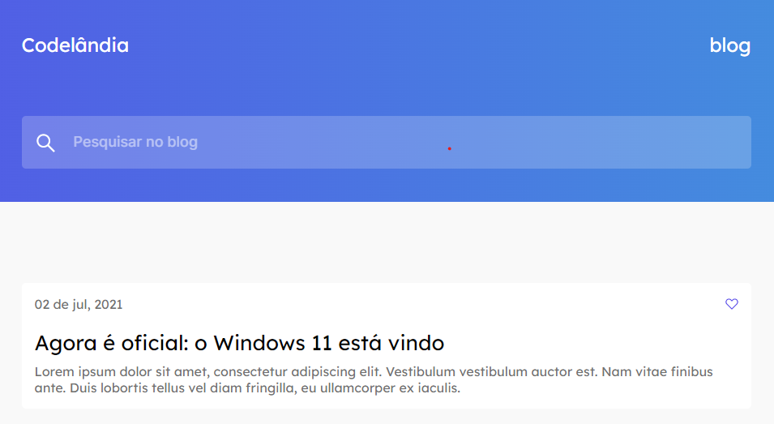

# Desafio 01 Codelândia

Trabalho desenvolvido para o Desafio 01 da Codelândia. O foco deste exercício foi o posicionamento de elementos e a aplicação do flexbox para a responsividade do site.

# Links

Deploy > https://viniciusgalmeida.github.io/Desafio-01-Codelandia/ 

Figma do desafio > https://www.figma.com/file/Yb9IBH56g7T1hdIyZ3BMNO/Desafios---Codel%C3%A2ndia?node-id=0%3A1 

# Feito com:

